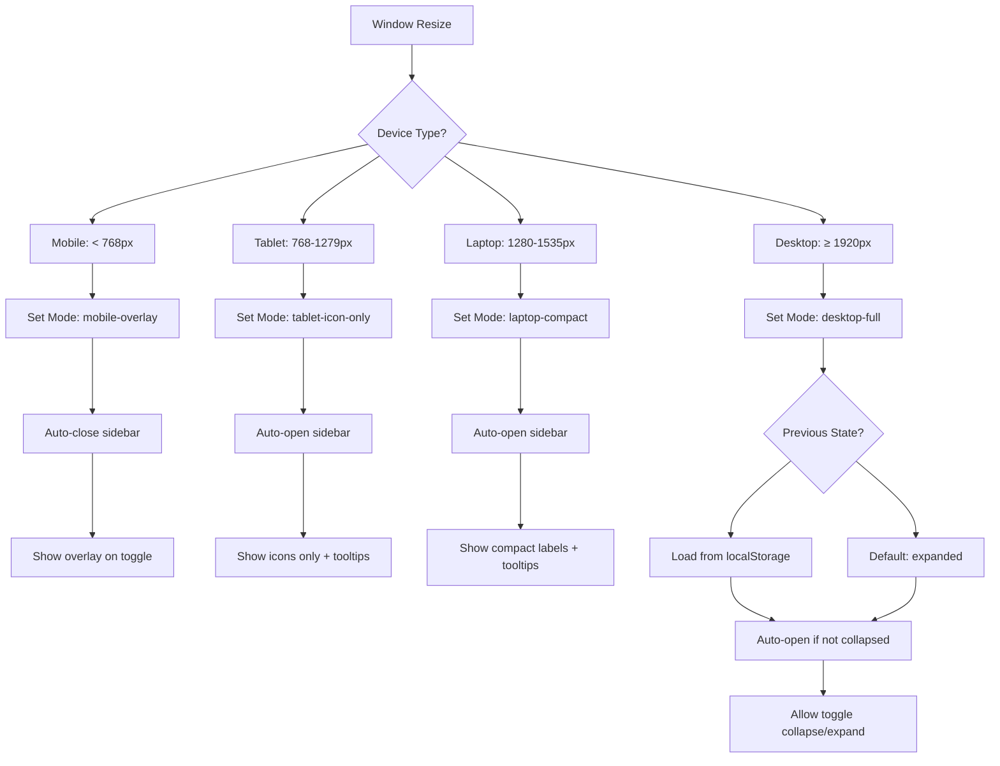

# Responsive Sidebar System

This document explains the responsive sidebar system implementation, including device-specific behaviors and interactive modes.

## 📱 Device Modes

The sidebar adapts to different screen sizes with specific behaviors:

| Device  | Breakpoint      | Mode               | Width      | Behavior                                  |
| ------- | --------------- | ------------------ | ---------- | ----------------------------------------- |
| Mobile  | < 768px         | `mobile-overlay`   | 320px      | Overlay mode, open/close only             |
| Tablet  | 768px - 1279px  | `tablet-icon-only` | 64px       | Always open, icon-only with tooltips      |
| Laptop  | 1280px - 1535px | `laptop-compact`   | 80px       | Always open, compact with labels          |
| Desktop | ≥ 1920px        | `desktop-full`     | 256px/72px | Collapsible with localStorage persistence |

## 🎯 Behavior Flow



## 🔄 Toggle Behaviors

### Mobile (< 768px)

```javascript
// Simple overlay toggle
if (isOpen) {
  close(); // Hide overlay
} else {
  open(); // Show overlay
}
```

### Tablet (768px-1279px)

```javascript
// Always stays open, simple toggle
if (isOpen) {
  close();
} else {
  open();
}
```

### Laptop (1280px-1535px)

```javascript
// Always stays open, simple toggle
if (isOpen) {
  close();
} else {
  open();
}
```

### Desktop (≥ 1920px)

```javascript
// Complex collapse/expand logic
if (isExpanded && isOpen) {
  setCollapsed(true);
  close();
  saveToLocalStorage(true);
} else if (isOpen) {
  close();
} else {
  open();
  if (isCollapsed) {
    setCollapsed(false);
    saveToLocalStorage(false);
  }
}
```

## 🗂️ Module Structure

```
sidebar/
├── index.tsx                 # Main Sidebar component
├── sidebarToggler.tsx       # External toggler component
├── Sidebar.stories.tsx      # Storybook stories for sidebar
├── sidebarToggler.stories.tsx # Storybook stories for toggler
├── types.ts                 # TypeScript type definitions
├── components/
│   └── SidebarHeader.tsx    # Header sub-component
└── README.md               # This documentation
```

## 🔧 Key Hooks & Utils

### useSidebar Hook

Manages sidebar state, device detection, and toggle logic:

- Detects device type using useWindowSize
- Handles responsive mode switching
- Manages localStorage for desktop collapse state
- Provides toggle functions for different device types

### sidebarUtils

Contains helper functions:

- `getSidebarMode()` - Maps breakpoints to modes
- `shouldSidebarBeOpen()` - Determines auto-open behavior
- `shouldShowSidebarLabels()` - Controls label visibility
- `getSidebarWidth()` - Returns appropriate widths

### Redux State

```typescript
interface SidebarState {
  isOpen: boolean; // Sidebar visibility
  isCollapsed: boolean; // Desktop collapse state
  currentMode: SidebarMode; // Current responsive mode
  openMenus: string[]; // Expanded menu items
}
```

## 🎨 Responsive Styling

The sidebar uses Tailwind CSS with dynamic classes based on mode:

```javascript
// Layout centering for compact modes
const flexClasses = twMerge(
  "flex flex-col h-full font-plusjakarta text-sm",
  (isTablet || (isDesktop && isCollapsed)) && "items-center"
);

// Padding adjustments
const paddingClasses = twMerge("px-5 py-4", isDesktop && isCollapsed ? "p-4" : "px-5 py-4");

// Label visibility
const showLabels =
  currentMode === "mobile-overlay" ||
  currentMode === "laptop-compact" ||
  (currentMode === "desktop-full" && !isCollapsed);
```

## 🚀 Integration

### With Navbar

The `SidebarToggler` component is imported and used in the Navbar:

```typescript
// navbar/index.tsx
import { SidebarToggler } from "../sidebar/sidebarToggler";

// In render:
<div className='flex gap-2 sm:gap-3 items-center'>
  <SidebarToggler />
  <AppLogo />
</div>;
```

### With Layout

The sidebar is integrated into the dashboard layout with responsive positioning and animations.

## 🧪 Testing

### Storybook Stories

- **Sidebar**: Multiple viewport stories (Mobile, Tablet, Laptop, Desktop variants)
- **Toggler**: Device-specific behavior demonstrations
- **Interactive**: Real-time responsive mode switching examples

### Responsive Breakpoints Testing

- Use browser dev tools to test at different viewport sizes
- Verify auto-mode switching and open/close behaviors
- Test localStorage persistence on desktop

## 🔍 Common Issues

### Labels not showing on mobile

Check `showLabels` logic includes `mobile-overlay` mode.

### Desktop not remembering collapse state

Verify localStorage key-value pairs are being set correctly.

### Toggler not working

Ensure `SidebarToggler` component is properly imported and placed in navbar (not inside sidebar).

## 📝 Future Enhancements

- Add animation speed customization
- Implement drawer/rail modes for ultrawide screens
- Add keyboard shortcuts for toggle actions
- Implement swipe gestures for touch devices
